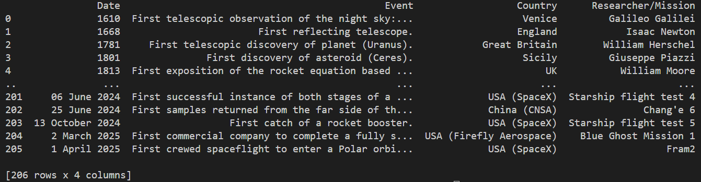

# Space-Exploration-Timeline

## A python script to scrape data from Wikipedia's "Timeline of Space Exploration article"

This is a Python script to scrape the timeline data from Wikipedia's "Timeline of Space
exploration article". The project was a chance to practise data scraping using Beautiful
Soup from the bs4 library, using Pandas dataframes, and learning how to clean data.

To view the full timeline data see the csv file.

Wikipedia article: https://en.wikipedia.org/wiki/Timeline_of_space_exploration

## Demo:

## Instructions:
Clone the git repo and run main.py.